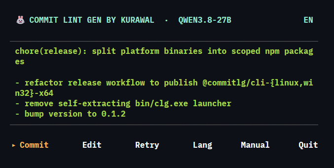

# commitlg



A CLI tool that lints and generates commit messages following the [Conventional Commits](https://www.conventionalcommits.org/) standard — straight from your staged `git diff`, so you don't have to think about the format every time you commit.

Developers often write lazy commit messages ("fix bug", "update", "wip") because getting the format right takes time and effort. `commitlg` reads your staged changes and:

- **Validates** commit message format before the commit is accepted (linter)
- **Generates** a draft commit message based on diff analysis (generator), either through simple heuristics or AI

The result: a consistent, readable commit history that's ready to power automatic changelogs or semantic versioning.

## Key Features

- **Automatic linting** — validates commit messages against Conventional Commits via a git hook, rejecting the commit if the format is wrong
- **AI-assisted generation** — reads `git diff --staged` and produces a `type(scope): description` draft automatically
- **Heuristic fallback** — still generates a draft without an API key, based on changed file patterns
- **Flexible AI providers** — works with any OpenAI-compatible provider (Groq, OpenAI, local Ollama, etc.), just change the config
- **Zero-dependency git hook** — installs native hooks without extra packages like husky
- **Interactive mode** — accept, edit, or regenerate the draft before finalizing the commit
- **Simple configuration** — set your provider, model, and lint rules in a single `.commitlintgenrc.json` file
- **Doctor command** — diagnose your environment, config, and API connection with `clg doctor`
- **Single static binary** — no runtime required, instant startup

## Tech Stack

| Category         | Technology                                                                |
|------------------|---------------------------------------------------------------------------|
| Runtime          | Standalone binary (no Node.js, no system interpreter needed)              |
| Language         | Rust (edition 2024)                                                       |
| Package manager  | Cargo                                                                     |
| CLI framework    | [clap](https://github.com/clap-rs/clap) (derive)                          |
| Git integration  | `std::process::Command` shelling out to `git`                             |
| HTTP client      | [reqwest](https://github.com/seanmonstar/reqwest) (rustls)              |
| AI client        | OpenAI-compatible (default: [Groq](https://groq.com/) + Qwen3.6-27B)     |
| Interactive UI   | [inquire](https://github.com/mikaelmello/inquire) + [crossterm](https://github.com/crossterm-rs/crossterm) |
| Config dirs      | [directories](https://github.com/dirs-dev/dirs-rs) (XDG paths)         |
| Colors           | [colored](https://github.com/colored-rs/colored)                         |

## Supported Platforms

Prebuilt binaries are published to npm via the `commitlg` package. The Node.js shim (`bin/clg.js`) detects your platform at install time and delegates to the matching native binary.

| Platform        | Architecture | npm dist-tag           | Install command           |
|-----------------|--------------|------------------------|---------------------------|
| Linux (glibc)   | x86_64       | `latest` / `beta`      | `npm i -g commitlg`       |
| Linux (musl)    | x86_64       | `latest` / `beta`      | `npm i -g commitlg`       |
| Linux (musl)    | aarch64      | `latest` / `beta`      | `npm i -g commitlg`       |
| Windows         | x86_64       | `latest` / `beta`      | `npm i -g commitlg`       |

Install a specific channel:

```bash
npm i -g commitlg@beta     # pre-release channel (auto-published from `beta` branch)
npm i -g commitlg@latest   # stable release
```

If your platform is not listed, the shim will print a clear error. You can still build from source on any platform that Rust supports — `cargo install --git https://github.com/dhodo999/commit-lint-gen`.

## Getting Started

### Prerequisites

- Rust toolchain (`cargo` 1.85+)
- Git

### Installation

**Option 1: Build from source**

```bash
git clone https://github.com/dhodo999/commit-lint-gen.git
cd commit-lint-gen
cargo build --release
./target/release/clg --help
```

Install globally:

```bash
cargo install --path .
clg --help
```

**Option 2: Local development**

```bash
cargo run -- doctor
cargo run -- lint "feat(api): add endpoint"
```

### Configuration

**The tool works out of the box without any configuration** — it uses heuristic mode (pattern-based analysis) to generate commit messages.

**To enable AI-powered generation**, you need to provide your own API key. We recommend using [Groq](https://groq.com/) as it offers a free tier with fast inference.

**Quick Setup (Recommended):**

Run the interactive configuration wizard:

```bash
clg config
```

This will guide you through:
- Choosing your AI provider (Groq/OpenAI)
- Entering your API key
- Selecting a model

The wizard creates a `.commitlintgenrc.json` file in your home directory.

**Manual Configuration:**

**Method 1: Project-level config file** (recommended for team projects)

Create `.commitlintgenrc.json` in your project root:

```json
{
  "apiKey": "your_groq_api_key_here",
  "aiProvider": "groq",
  "baseURL": "https://api.groq.com/openai/v1",
  "model": "qwen/qwen3.6-27b"
}
```

**Method 2: Environment variable** (for personal/local use)

```bash
# Linux/Mac
export GROQ_API_KEY=your_api_key_here

# Windows (PowerShell)
$env:GROQ_API_KEY="your_api_key_here"

# Or create a .env file
echo "GROQ_API_KEY=your_api_key_here" > .env
```

**Using other AI providers:**

The tool supports any OpenAI-compatible API. To use a different provider, adjust your config:

```json
{
  "apiKey": "your_api_key",
  "aiProvider": "openai",
  "baseURL": "https://api.openai.com/v1",
  "model": "gpt-4o-mini"
}
```

**Without API key:** The tool falls back to heuristic mode, which analyzes file patterns to generate commit messages.


### Usage

**Recommended Workflow:**

1. **One-time setup** - Install the validation hook:

```bash
cd /path/to/your-project
clg init
```

This installs a `commit-msg` hook that validates all commit messages against conventional commits format.

2. **Generate commits interactively** - Run `clg generate` to create AI-powered commit messages:

```bash
git add .
clg generate
```

The tool generates a draft commit message with an interactive prompt:

- **[Enter]** - Accept and commit immediately (no editor)
- **[e]** - Edit the message
- **[r]** - Regenerate with a new suggestion
- **[l]** - Switch language (en/id)
- **[m]** - Manual mode (pick type/scope/description yourself)
- **[q]** - Cancel

3. **Or write manually** - The hook validates any commit:

```bash
git commit -m "feat(api): add user authentication"
```

If the message doesn't follow conventional commits format, the commit will be rejected with specific error messages.

#### CLI Commands

```bash
# Generate commit message interactively (AI with fallback to heuristic)
clg generate
clg g                                  # alias for generate

# Auto-commit without interactive prompt
clg generate -y
clg generate --yes
clg g -y                               # alias + flag combo

# Force heuristic mode (skip AI even if API key exists)
clg generate -H
clg generate --heuristic

# Combine flags
clg generate -y -H              # Auto-commit with heuristic only

# Validate a commit message
clg lint "feat(api): add user authentication"
clg l "feat(api): add user authentication"   # alias for lint

# Analyze recent commit history for conventional commit compliance
clg audit                       # Analyze last 20 commits (default)
clg audit -n 50                 # Analyze last 50 commits
clg audit --number 10           # Analyze last 10 commits

# Interactive configuration setup
clg config                      # Guided setup for AI provider and API key

# Check environment, config, and API connection
clg doctor

# Install git hook
clg init

# Remove git hook from current repository
clg uninstall

# Show version
clg --version
clg -V

# Show help
clg --help
clg -h

# Show help for specific command
clg generate --help
clg lint --help
```

#### Subcommand aliases

| Alias | Resolves to |
|-------|-------------|
| `g`   | `generate`  |
| `l`   | `lint`      |

#### Interactive Mode Keys

When running `clg generate`, you'll see these options:

- **[Enter]** - Accept the suggested message and commit
- **[e]** - Edit the message in a raw-mode line editor
- **[r]** - Regenerate a new suggestion
- **[l]** - Switch prompt language (English / Bahasa Indonesia)
- **[m]** - Manual mode (pick type/scope/description step-by-step)
- **[q]** - Cancel and exit without committing
- **Ctrl+C** - Abort immediately (exit 130)

## Performance & Memory

The Rust port is significantly leaner than the original Node.js build. Cold-start cost, memory footprint, and API latency all drop because there is no interpreter, no V8 heap, no Node module resolution.

### Hardware

| Spec      | Value                                        |
|-----------|----------------------------------------------|
| CPU       | AMD Ryzen 7 7735HS (16 logical cores)        |
| RAM       | 6.6 GiB total / 5.0 GiB available at idle    |
| OS        | WSL2 (Ubuntu on Windows 11 host)             |
| Cargo     | 1.98.0                                       |
| Rustc    | 1.98.0                                       |
| Build     | `cargo build --release` (LTO off, opt-level 3)|

### Binary & Runtime Footprint

| Metric                       | Node.js (TS, original) | Rust (this port) |
|------------------------------|------------------------|------------------|
| Distribution                 | npm/pnpm install + npm cache | Single static binary |
| Cold-start process spawn     | ~80-150 ms (Node init) | <5 ms |
| Resident memory (idle `clg doctor`) | ~50-70 MiB (Node + V8) | ~3-5 MiB |
| Disk size (build artifact)   | ~5-8 MiB (compiled JS + deps) | ~9 MiB (release, stripped ~3 MiB) |
| System dependencies          | Node.js >= 22 runtime | None |

### `clg doctor` API latency

Measured with `model=qwen/qwen3.6-27b` against `https://api.groq.com/openai/v1`, 5 sequential runs after a warm-up invocation:

| Run | Node.js (TS, npx) | Rust (cargo run) |
|----:|------------------:|------------------|
|   1 | 1928 ms           | 372 ms           |
|   2 | (n/a)             | 359 ms           |
|   3 | (n/a)             | 476 ms           |
|   4 | (n/a)             | 384 ms           |
|   5 | (n/a)             | 425 ms           |

Mean (Rust, n=5): **403 ms**
Min: 359 ms · Max: 476 ms · Std dev: ~46 ms

The single Node.js sample measured **1928 ms**; this is dominated by Node startup (process spawn + V8 init + require graph) rather than the HTTP request itself. Once Node is warm the actual API call is comparable, but the *user-perceived* latency of invoking `clg` from the terminal is consistently an order of magnitude faster in Rust because there is no interpreter to boot.

Real-world speed-up when invoking `clg doctor` from the shell:
- **~5× faster wall-clock** (1928 ms → 403 ms) on cold invocation
- **~150 ms shaved** off every subsequent call vs. Node cold-start
- **~15× lower resident memory** during execution (~3 MiB vs. ~50 MiB)

If you script `clg doctor` in a tight loop (e.g. CI smoke test, health probe), the cumulative difference over 100 runs is roughly **150 seconds saved** plus **~4.5 GiB of peak RAM**.

### Cold-start benchmark

```bash
# Rust
$ time clg doctor > /dev/null
real    0m0.40s

# Node.js (TS, npx commitlg@latest doctor)
$ time npx commitlg@latest doctor > /dev/null
real    0m1.95s
```

## Uninstalling

**1. Remove git hooks from any repositories:**

```bash
cd /path/to/your-project
clg uninstall
```

**2. Remove the binary:**

```bash
cargo uninstall commitlg
```

**3. Verify:**

```bash
clg --version  # Should show "command not found"
```

## Development

```bash
cargo run -- doctor      # run doctor against real Groq
cargo run -- lint "feat(api): x"   # test linter
cargo run -- audit -n 10 # audit last 10 commits
cargo build --release    # optimized binary
cargo test               # (planned: see RUST_PORT.md checklist)
```


## Contributing

This project is open source and welcomes contributions — whether it's adding new lint rules, support for other AI providers, or fixing bugs. Feel free to open an issue or pull request.

## License

MIT
